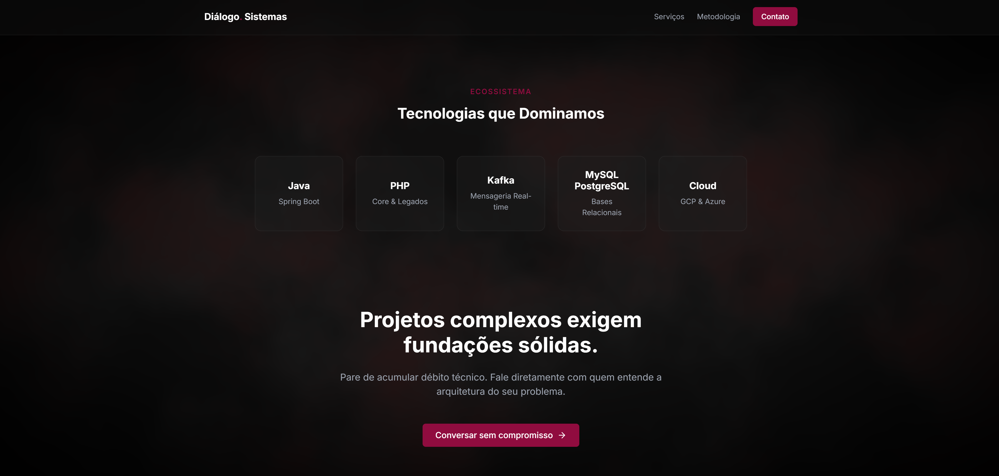

  <h1>Diálogo. Sistemas</h1>
  
<b>Core Repository & Engineering Guidelines</b>

  
  
  

 

> **Manifesto Técnico** > Este repositório não admite concessões arquiteturais. O domínio é o centro do sistema e não depende de frameworks, ORMs ou bibliotecas externas. Frameworks são tratados como detalhes de infraestrutura, estritamente isolados via interfaces e adapters. Operamos sob a filosofia de que código não testável ou acoplado é código legado desde o dia zero.

---

## ⚙️ Ecossistema & Stack Tecnológica

| Categoria          | Tecnologias                 | Objetivo na Arquitetura                                    |
| :----------------- | :-------------------------- | :--------------------------------------------------------- |
| **Linguagens**     | `Java` (Spring Boot), `PHP` | Microsserviços, sistemas core e refatoração de legados.    |
| **Mensageria**     | `Apache Kafka`              | Arquitetura orientada a eventos e processamento real-time. |
| **Dados**          | `MySQL`, `PostgreSQL `      | Persistência relacional de alta consistência.              |
| **Infraestrutura** | `GCP`, `Azure`, `Docker`    | Implantação escalável e ambientes containerizados.         |

---

## 📐 Diretrizes de Código & Clean Architecture

A aprovação de qualquer Pull Request está condicionada ao cumprimento estrito destas regras:

- **Princípios Base:** Adesão inegociável ao `SOLID`, `DRY` e `KISS`. Aplique padrões de projeto apenas com necessidade real e tangível.
- **Isolamento de Domínio:** Utilize _Entities_, _Value Objects_ e _Repositories_ apenas quando fizerem sentido semântico no domínio do negócio.
- **Limitação de Parâmetros:** Métodos devem possuir **poucos parâmetros**. Se exceder, encapsulamos os dados num DTO (Data Transfer Object).
- **Coesão de Classes:** As classes devem ter uma única responsabilidade.
- **Proibições Rigorosas:** É estritamente proibido o uso de métodos estáticos para executar lógica de negócio pura. Exceções não podem ser silenciadas ou mascaradas.

---

## 🖋️ Nomenclatura e Formatação

<table>
  <tr>
    <td width="150"><b>Idioma</b></td>
    <td>Todo o código (classes, variáveis, métodos, comentários) <b>sao escritos em inglês</b>.</td>
  </tr>
  <tr>
    <td><b>Classes</b></td>
    <td><code>PascalCase</code>. Nomes expressivos que reflitam o propósito de negócio. É proibido o uso de abreviações ambíguas.</td>
  </tr>
  <tr>
    <td><b>Métodos</b></td>
    <td><code>camelCase</code>. O nome deve iniciar sempre com um verbo claro que defina a ação exata (ex: <code>calculateTotal()</code>).</td>
  </tr>
  <tr>
    <td><b>Padrões (PHP)</b></td>
    <td>Aderência obrigatória aos padrões mundiais <b>PSR-1</b> e <b>PSR-12</b>.</td>
  </tr>
</table>

  

<i>© 2026 Diálogo Sistemas. Código sustentável, entregas transparentes.</i>

